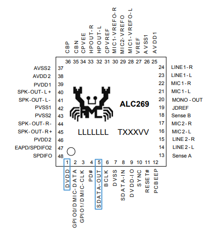
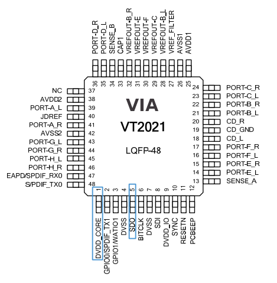
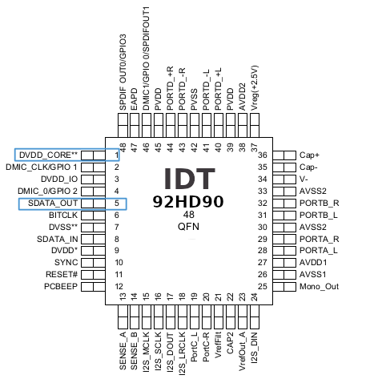
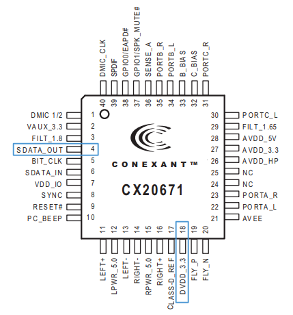

### `HDA_SDO` / `DVDD` pins assignment on Intel High Definition Audio codec chips

This table provides known information on `DVDD` (`DVDD_CORE`) & `HDA_SDO` (`SDO`, `SDATA_OUT`) pins assignment on various Intel HDAudio chips. Please submit a PR or an issue to update this table.

DVDD | SDO | Model
--- | --- | ---
1  | 5  | Realtek ALC262
1  | 5  | Realtek ALC269
1  | 5  | Realtek ALC882
1  | 5  | Realtek ALC888
1  | 5  | Realtek ALC892
1  | 5  | Realtek ALC1150
1  | 5  | Realtek ALC3235
1/9  | 5  | IDT 92HD73C
1/7  | 4  | IDT 92HD87
1/9  | 5  | IDT 92HD90
1/9  | 5  | IDT 92HD93
1/9  | 5  | IDT 92HD202
1/9  | 5  | VIA VT1705
1/9  | 5  | VIA VT1708B
1/9  | 5  | VIA VT1708S
1/9  | 5  | VIA VT2021
1/3/9 | 5  | Conexant AD1884A
18 | 4  | Conexant CX20671
18 | 4  | Conexant CX20672
9  | 1  | Conexant CX20724

> * **NOTE:** The codec is compatible with either 1.5V or 3.3V HDA bus signaling. IDT has `DVDD_CORE` and `DVDD` pins which are 1.8V ~ 3.3V and 3.3V, usually both of them work for powering the HDA_SDO pins. The `DVDD` pin is usually 9 so it may be used too instead of 1 (`DVDD_CORE`). VIA use `DVDD_CORE` for 3.3V and `DVDD_IO` for 1.5V ~ 3.3V so usually both of them work too

Shorting those pins on Intel chipsets series >=6 will result into a Flash Descriptor security override enabled, which permits flashing SPI flash (Flash Descriptor/BIOS/ME/...) using software such as Intel Flash Programming Tool (FPT) via an SPI present on chipset. This programming method is safer than performing in-circuit programming with an external programmer and is adequate for [removing hardware backdoors such as Intel ME](https://github.com/mostav02/Remove_IntelME_FPT) or flashing [coreboot](https://github.com/coreboot/coreboot), however you must always understand what you are doing and make full SPI flash dumps before writing any flash regions. If you brick your device, you will still need to use an external programmer after to restore the flash memory from a full dump you made before.

Photos of chip locations on some specific systems can be found here https://github.com/mostav02/Remove_IntelME_FPT/tree/master/Unlocking_Flash_Descriptor

#### Examples of original pinouts

